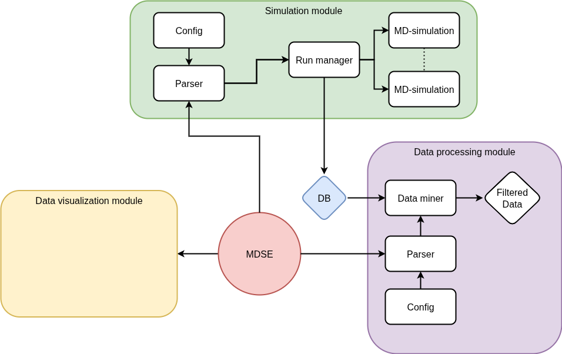

==============================
Technical Documentation
==============================

Introduction
============

This is an introduction! Some text...

Background
==========

Short info about underlying concepts and the most important packages/programs being used

ASE

ASAP

httk

mongoDB

docker?

sqlite, or Joels DB info

Parallellization

Super computer

System Overview
===============

MDSE is divided into three major modules, each managing their own large task. This limits which parts of the code can communicate, makes the software less cluttered and makes it easier to expand upon in the future.

The simulation module is the main component of MDSE. Running on the ASE and ASAP libraries this module will setup, plan and execute all simulations.

The Data Processing Module

The Data Visualization Module

Other header (find a good name)?!?
==================================

Something to describe systems on a lower level
